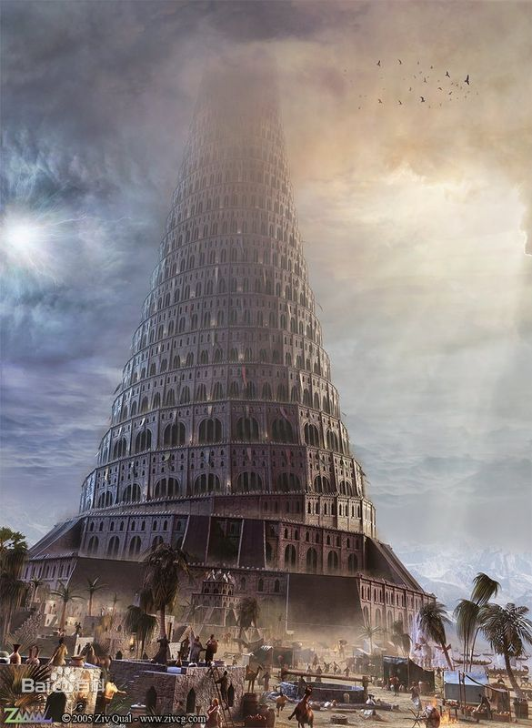

当时地上的人们都说同一种语言，当人们离开东方之后，他们来到了示拿之地。在那里，人们想方设法烧砖好让他们能够造出一座城和一座通天塔来传播自己的名声，以免他们分散到世界各地。上帝来到人间看到了这座城和通天塔说，**一群只说一种语言的人以后便没有他们做不成的事了**；于是上帝将他们的语言打乱，这样他们就不能听懂对方说什么了，还把他们分散到了世界各地，这座城市也停止了修建。这座城市就被称为“巴别城”。圣经是这样描写的：

> 4 他们说，“来吧，我们要建造一座城和一座塔，塔顶通天，为了扬我们的名，免得我们被分散到世界各地。”
>
> 5 但是耶和华降临看到了世人所建造的城和塔。
>
> 6 耶和华说，“**看哪，他们都是一样的人，说着同一种语言，如今他们既然能做起这事，以后他们想要做的事就没有不成功的了**。”
>
> 7 让我们下去，在那里打乱他们的语言，让他们不能知晓别人的意思。
>
> 8 于是耶和华使他们分散到了世界各地，他们也就停止建造那座城。
>
> 9 因为耶和华在那里打乱了天下人的言语，使众人分散到了世界各地，所以那座城名叫巴别。
>
> ——创世记11:4–9[[10\]](https://zh.wikipedia.org/zh-cn/巴別塔#cite_note-10) 

