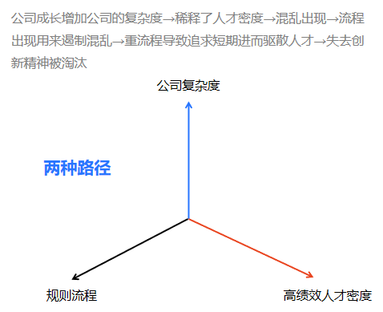
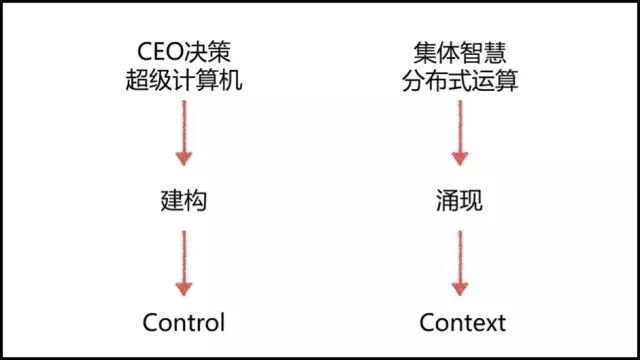
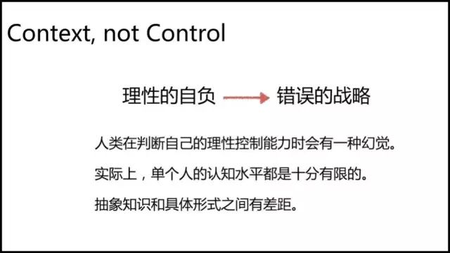
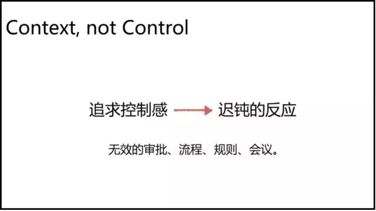
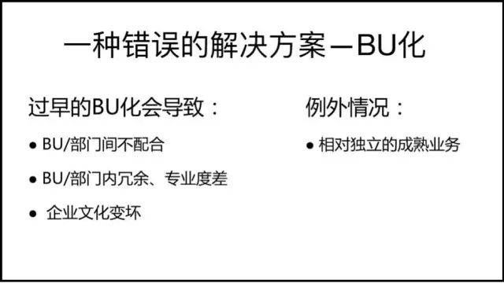
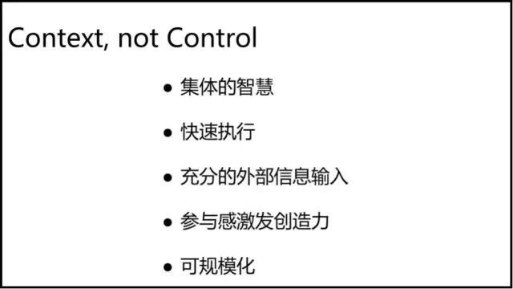
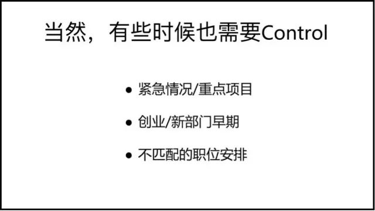
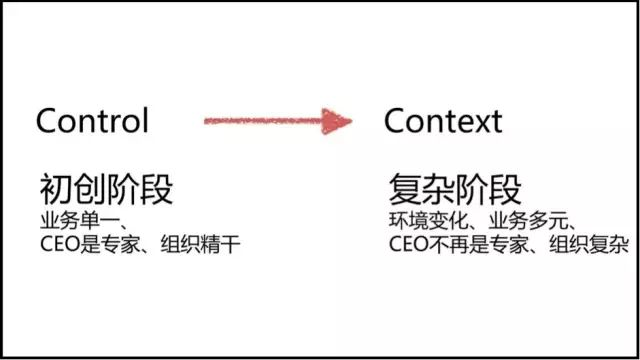
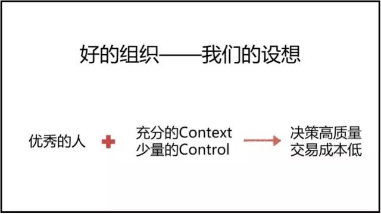
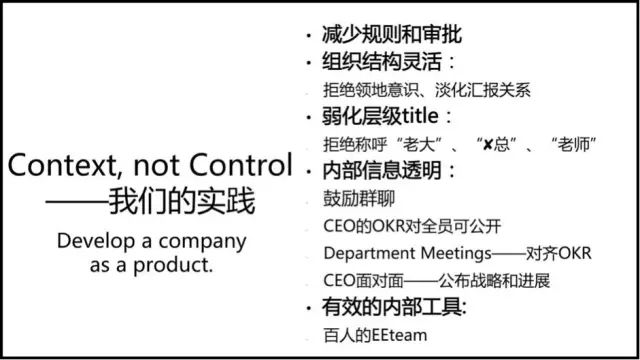

### 字节跳动创始人、CEO张一鸣的一篇经典演讲 《做CEO要避免理性的自负》
##### 应对企业发展的复杂度
业务复杂度，代表公司业务的多样性，公司业务之间需要配合的程度。

 
在这样的情况下，公司面临有4种选择：

1. 小而美：
为了不让业务变得复杂，保持小而精干的人才队伍。
*弊端：企业规模小，做不了大事业*

2. 上流程：
拓展业务边界，同时增加流程和规则，以防止出乱子、出问题。
*弊端：限制过多，影响员工创造力的发挥，长此以往导致组织僵化，规则成为企业发展阻碍。*

3. 无流程：
不设置流程与规则。
*弊端：没有流程的公司只会变得很乱*

4. 靠人才：
*提高人才的密度，增加有大局观、有好价值观、知识和能力也很全面的人才。*

把优秀的人聚集起来之后，该怎么做事情呢。
 怎么建立一个有效的组织，怎么在公司从小变大的过程中，应对管理上面临的挑战。这也是在成长过程中，我们常常讨论和思考的问题。现在，我们倾向于“Context，not Control”的解决方案。

打个比方，来解释Context和Control的区别。

计算机有两种处理任务的方式： 一种是超级计算机，用一台计算机处理很密集的任务；一种是分布式的运算，让很多机器共同来处理任务，把任务分解，把任务所需要的资源分解。

##### 有两种企业管理的模式分别跟这两种运算方式类似。 
 

**第一种**， 把CEO当成超级计算机， CEO做战略设计，提出战略计划，逐层分解之后执行，执行的过程中如果遇到情况，会再往上汇报，CEO汇总信息，再次定出工作任务，这个过程中有审批、有流程，有很多的管理机制。过去很多企业都是采取这样的方式，主要包括：**建构战略和控制流程**。

**第二种**， 有更多的人参与决策，让更多的想法自下往上涌现出来，而不是一个从上到下的战略分解，这个过程中需要更多人基于上下文Context做出判断，而不是根据指令来执行。

具体来讲，什么是Context，什么是Control。

Context是指决策所需要的信息集合，包括原理是什么，市场环境如何，整个行业格局如何，优先级是什么，需要做到什么程度，以及业务数据和财务数据等等。

Control则包括了委员会、指令、分解和汇总、流程、审批等等。

##### 为什么我们倾向于“Context，not Control”呢? 

 

在我们看来，Control往往会带来一些危险。 **人类在判断自己的理性控制能力时会有一种幻觉，对于聪明理性的人更是如此，常抱有理性的自负。**
CEO们往往有过成功的经验，尤其在公司早期成功过，且CEO没有上级，很少被人challenge，容易觉得自己英明神武。
但是大家忽视了一点，行业是不断发展的，你所具有的知识虽然丰富，但在行业不断变化中依旧是有限的。
有时候，CEO们会误以为，自己提出的方法论特别好，模型特别优雅，希望把它执行，或者在全公司大范围内推行，但忽略了抽象知识和具体形式之间有差距。
**理性往往只适合做知识抽象，对具体问题的解决，不一定真的有帮助。** 当然我们并不要否定理性的作用，只是要避免过度放大理性带来的危险。

自上而下的宏大战略往往都是灾难，业界也发生过不少真实的例子：
比如windows vista，这个项目是比尔盖茨按自己技术理念力推的，提了一系列的宏大理念，计划2003年上线。 这些理论听起来都非常好，非常领先， 但是一直到2006年 才真正上线,中间还重构了一次,把目标降低，重新修改了计划，最终才把Vista推出去。
乔布斯也犯过同样的错误。 第一次离开苹果做NeXT的时候，他提出一个非常理想的做计算机的模式，包括优雅的操作系统，完全面向对象（Object Oriented）的语言，但是最终也没有卖出多少台。
中国也有这样的例子，曾经盛大易宝的理念也很宏大，但和当时无论是文娱行业、互联网带宽，还是政策环境的情况都不匹配，所以最后失败。 

##### Control除了会带来战略上的问题，还会因为追求控制感而导致企业反应迟钝。 
 
 在座的都是CEO，我们可以把支出、合同、offer，全部加起来算算每天的审批有多少。假设一天是15个的话，一年就是5000多个。
这其中真正有效的有多少，经过大家认真思考的有多少？还是它的存在纯粹基于控制感？好像做了支出审批，资金就不会被乱使用。
相较而言，你的下属或者其他人是不是能够更好地审批？我想是的，因为他们在一线决策，有更充分的外部信息。由于CEO精力有限，大量的审批延时，让很多事情平白增加了一天到两天的时长。 

##### 过早BU化是一种比较普遍的错误解决方案
 

 针对公司变大后，会出现的这些问题，有一种错误的解决方案——过早BU化。 这种方案会导致几个问题：

第一，**部门间不配合**。 比如说，BU自己处理PR危机，自己招工程师，就不用找市场或技术同事了，部门之间就不用配合，或者说会导致配合变得更差了，因为不花心思磨合了。
第二，**部门内冗余，专业度变差**。 比如说，单个BU招的工程师标准不够高，而且工程师团队规模不够大，互相学习不够，进步提升不够，专业程度变差，内部也变冗余。对于CEO来说，感觉更像承包者，我把这个任务发出去了，你自己做吧，我不参与过程，我只要结果。长此以往，企业文化就变差了。
当然有一些例外，如果是相对独立或非常成熟的业务，确实不需要公司内部支持和配合，可以BU化。
公司存在的意义就是为了分工和配合，公司内的业务活动，要确保内部合作成本低于市场交易成本。大量不配合的BU，本质就不应该存在于企业内部。
过早BU化是一种比较普遍的错误解决方案。很多公司过早成立很多子公司，或者拆成很多项目组，甚至更进一步把业务独立出去，独立融资。
在我看来，这些往往都不是好的解决方案，而是懒惰的解决方案，如此就不用解决配合和沟通问题了。 

#####  相比Control，强调Context的管理模式有什么好处？ 
 

    第一，分布式运算，让更多人用更多CPU进行运算，让更多人参与决策，利用集体的智慧。作为管理层，你做审批决策只花30秒，但别人可以花三个小时，做更多的调研之后才判断。
    
    第二，可以更快速地执行。不需要层层汇总，不需要汇总到一处，不需要在CEO这里排队列，能够更及时地响应。
    
    第三，充分的外部信息输入。在Control的模式中，任何信息都要到CEO这个节点，靠CEO再分发出去。CEO很大程度变成了公司和外部之间的接口。相比单靠CEO接触外界情况，了解市场行业或者宏观经济，让更多的同事，更多主管直接面向行业，信息肯定会更充分，角度也不一样。
    
    第四，参与感激发创造力。做同样的事情，如果员工知其然，也知其所以然，会比只知道指令，做起来更有意思。这个对于发挥员工创造力是有帮助的。
    
    第五，可规模化。Context的建设，表现形式可能是内部的系统，可能是知识共享文档，这些都是可以复用的，是可规模化的。而CEO和管理团队的时间精力有瓶颈，靠拼体力、脑力、耐力来解决，是有瓶颈的，是没有规模效应的。

##### 当然，有时候也需要Control： 
 

一、紧急情况和重点项目。 比如说重大的PR危机需要快速响应。重点项目也是如此，如果竞争对手已经逼进，这个时候进行分布式的讨论，自下而上的涌现，来不及解决问题，时间窗口很快就过去了，所以紧急情况和处理重点项目需要Control。
二、创新业务和新部门的早期。 如果一个部门新设立，或者一个新高管上任，还没有跟公司磨合好，这个时候需要Control。创新业务早期，需要更多支持配备资源的时候，也需要CEO的统一协调，主导进展。
三、不匹配的职位安排。 某个岗位的人跟公司理念差距很大，那么他的上级也是需要Control来干预的。

#####  为什么公司发展一段时间后会出现这个问题，而公司早期不会出现？ 
 

因为在公司早期的时候，CEO一般都是业务的专家。公司业务简单，行业情况简单，CEO自己做决策就可以了，这样效率高。
但随着公司的成长，CEO精力被很多事情分散，PR、融资、外部活动等等，组织本身也非常消耗管理者精力。
另外，环境变复杂，业务多元化，CEO不再是专家，甚至对业务也不是最灵敏的人了。
我们要求CEO快速学习成长，超级计算机变得越来越强，知识面越来越广，但是人的精力总是有限，总有很多方面是不如创业阶段的时候。
比尔盖茨20年前是一个优秀的架构师，20多年之后，还是要用他的理念来指导整个的大型项目，作用就非常有限了。
当然有些企业不存在这样的问题，因为他们所处的行业稳定，创新较少，遵守好传统的流程就可以了，比如说老干妈辣酱。 

#####  总结而言，我们认为好的组织包括： 
 

一，**优秀的人**。
需要分布式的处理器，不只是一个执行者，每一台分布式计算机都有判断能力，都要聪明。

二，“**充分Context，少量Control**”的管理模式。
每个人有他需要扮演的角色，掌握所有的上下文信息，做出业务决策。在必要的时候，做出少量的干预。

有了以上两点，就能保证组织内的交易成本最小，并且做出高质量的决策。
基于这个理念，在我们公司，遇到问题的时候，往往习惯先问Context是不是不够充分，而不是增加Control。
比如说某项进展出了问题，我们首先不考虑让更高阶的人来做，而是反过来想，是不是Context不够，是不是没有把行业的情况、业务数据、过去的失败案例分享给他。
作为管理者，要想想你作出比他人更好的决策，是因为能力还是你的context更充分，是不是存在信息不对称？大家仔细观察会发现，有时管理者甚至利用信息不对称来体现自己的价值。所以，在公司内首先要把建设Context这个基础工程做好了，然而这并不容易，需要大量的沟通、管理和产品技术工作。 

#####   从具体操作层面，我们做了一些实践，分享给大家： 
 
###### 第一，减少规则和审批。
不允许部门随便出规定，即便不得不有规则，我们也希望规则非常简单，不允许有长达几页纸，非常难执行的规定。要减少审批，甚至希望尽量不要审批。

###### 第二，组织结构灵活，拒绝领地意识，能灵活调整汇报关系。
让大家意识到，汇报关系只是汇总信息一种方式，只要业务需要就可以随时调整。
如果我们有一个项目非常重要，我们可能需要市场部的同事都支持这个项目，那在这段时间里，这个项目的主管也是市场部同事的主管。

###### 第三，弱化层级跟title。
我们鼓励年轻人多提想法。我第一次担任CEO是26岁，我相信我们公司26岁的人有很好的实践经验，受过很好的教育，只要给他们好的context，他们也能做出好的决策。

为了避免形式感给基层节点带来压制，我们弱化层级，首先是不允许这种称呼——“老大”、“某某总”、“老师”，这种称呼一旦出来之后，很多想法就不能涌现出来了。他们可能会倾向于先听听“老师”有什么意见，自己不能先说出来。

我们没有title带来的日常可见的待遇区别，比如什么样的人配备什么样的电脑，什么样的人配备什么样的办公桌，这样也会带来层级感，也会影响不同的同事发表意见。

###### 第四，我们鼓励内部信息透明。

我们鼓励群聊，各部门之间充分沟通，不要只跟CEO沟通。也不提倡一对一的沟通，我们认为一对一的沟通效率很低。如果有新加入的同事或者高管希望跟我一对一的沟通，我经常会说你可以抄送给我，但你首先发给其他人，发给需要和你配合的人。

我们让管理层的OKR对下属员工保持公开，让大家知道你在做什么，为什么在做这个事情，其他部门的人在做什么。

OKR的制定过程也不是自上而下的分解，而是大家互相之间自己对齐。看一下上级的OKR，看一下别的部门的OKR，看一下同级的OKR，了解目前公司最重要的任务是什么，这个季度最重要的任务是什么，我做什么能够帮助他们。

季度会也是尽量让相关人多参与，并不是一个非常小范围的高管会。我们还会经常举办CEO面对面，在这个会上回答员工提问，让大家了解公司进展。

###### 第五，我们认为做到充分建立context，需要好的内部系统做支持。

我们有将近100个人的内部工具开发团队，做各种工具尝试。比如我们自己开发了OKR系统，并且和内部使用的IM打通，方便大家互相查看。

这些基础工具，第一可以让人更轻松，第二可以规模化。新人加入公司，很快能适应OKR系统，很快可以看到内部的资料，从内部获取信息。

他也能意识到，他不仅仅有获得信息的权利，也有支持相关工作的责任。这样的实践，在我们看来，是把公司当成产品来建设，让公司内部的context更有效，让这个系统分布式处理能力更强。 

<!--分布式视角、节点赋能、创新支撑-->

