### 线性沟通模式

- **发送者**: 制造信息的人
- **编码**：把思想注入符号和手势中
- **信息**：被传递的信息
- **渠道**：信息传递的媒介
- **接受者**：接收信息的人
- **解码**：为信息赋予意义
- **噪音**：干扰传递的阻碍因素

### 交流沟通模式
交流沟通模式更新和扩展了线性模式，更准确地掌握了人类沟通的独特性。

- **沟通者**：沟通者取代了"发送者"和“接收者”，沟通者代表我们同时发送和接收信息这个事实。

- **背景**：背景指环境和来自沟通者资深的个人经验和文化脉络，会影响我们理解别人的方式。
- **噪音**：除了线性模式中特指的沟通渠道的**外在噪音**，也包括个人的**生理噪音**和**心理噪音**。