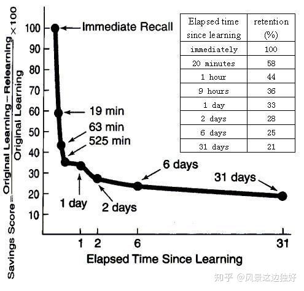

**人在获取信息后的一天内遗忘掉74%, 因此信息处理和反馈越早越快越好。**

|  时间    |    遗忘  |   记住   |
| ---- | ---- | ---- |
|20分钟后|42%被遗忘掉|58%被记住|
|1小时后|56%被遗忘掉|44%被记住|
|1天后|74%被遗忘掉|26%被记住|
|1周后|77%被遗忘掉|23%被记住|
|1个月后|79%被遗忘掉|21%被记住|

