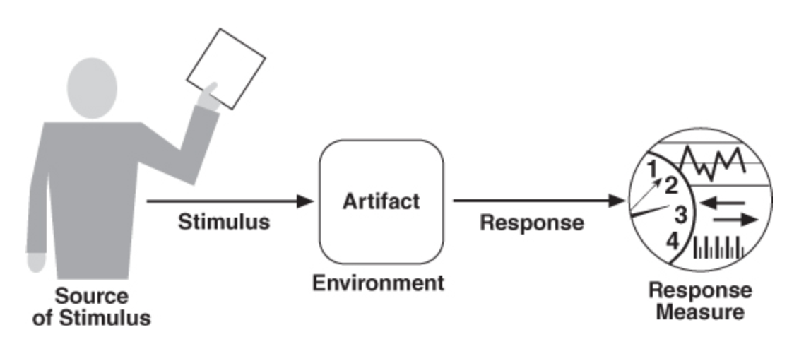

## 软件架构特性
作者 sergiuoltean  译者 王强  策划 万佳
翻译:[21 大软件架构特性全面解析]( https://www.infoq.cn/article/HSZFGNJtcLCOaUpVGxl0)
发布于：2020 年 8 月 7 日 13:47
原文: [Introduction to Architecture characteristics](https://sergiuoltean.com/2020/06/26/architecture-characteristics/)

众所周知，架构特性多以"ility"结尾（例如 scalability、deployability），也被称为 NFR（非功能需求）、质量属性。架构的特性没有固定清单，但标准是有的，就是 [ISO25010](https://iso25000.com/index.php/en/iso-25000-standards/iso-25010)：
 

我们从业务需求（业务特征）、我们期望的系统运营方式（运营特征）中总结出这些特性，它们是隐式的、贯穿各领域，是架构师在字里行间能看出来的特性。《软件架构基础》书中的这张表是隐藏特性的一个例子。

|  关注领域    |   架构特性   |
| ---- | ---- |
|   企业并购   |   互操作性、可伸缩性、可适应性、可扩展性   |
|   产品面市时间   |  敏捷性、可测试性、可部署性    |
|   用户满意度   |  性能、可用性、容错性、可测试性、可部署性、敏捷性、安全性    |
|   竞争优势   |  敏捷性、可测试性、部署性、可伸缩性、可用性、容错性    |
|   时间和预算   | 简单性、可行性     |

《实践中的软件架构》一书中对架构特性解释得很清楚。
 
**刺激的来源** （Source of Stiumulus）可以是角色、触发事件的东西等。**刺激** （Stimulus）是实际产生的事件。**环境** （Environment）代表事件发生的系统条件。**工件** （Artifact）是系统中正在被刺激的部分。**响应** （Response）就是工件在我们应该**度量**（measure）的刺激下的行为方式。

### 21个重要的软件架构特性
1. 性能
2. 可靠性   exp（-t/MTBF）
3. 可用性  MTBF/(MTBF+MTTR), MTBF= 平均无故障时间；MTTR= 平均修复时间
4. 弹性(Resiliency),容错性
5. 可信赖性: 可靠性 、可用性 、弹性 、可持续性 （可用性 / 弹性的比值）、可恢复性 （弹性函数）和稳健性 （可靠性函数）
6. 可伸缩性,灵活性
7. 安全性: **机密性**是指系统保护用户数据安全的能力； **完整性**是保护外部资源免遭篡改的能力； **身份验证**允许用户访问系统；**授权**则告诉用户可以访问系统的哪些部分。
8. 互操作性,系统与外部系统通信的能力。**合约接口**是互操作性中最重要的概念，其涵盖了通信的所有方面，包括错误处理。
9. 可调整性,可变性 ，其描述了系统变化的难易程度。
10. 可部署性
11. 可测试性,确保构建的系统尊重了客户的需求
12. 简单性,这条特征是很难实现的。一切都是权衡取舍，而大多数情况下这一条都会被牺牲掉。
13. 可移植性
14. 易用性
15. 可扩展性
16. 抗脆弱性,系统应对压力、冲击、波动、噪声、错误、故障或攻击的能力。
17. 可升级性
18. 合规性
19. 成本. 代码质量是另一项投资。好的代码将带来更好的测试，提高稳健性、可维护性、可调整性等。与难以维护的系统相比，我们的更改花费的时间会更少，成本会下降。
20. 可存档性,指系统保留历史数据记录的能力。在数据是一等公民的系统中（例如财务系统），这个特征非常重要。
21. 可审核性 / 可跟踪性,我们必须记录所有关键操作（尤其是在安全场景中），以便重现问题并从错误中学习经验。我们也可以将这些记录用作法律依据。