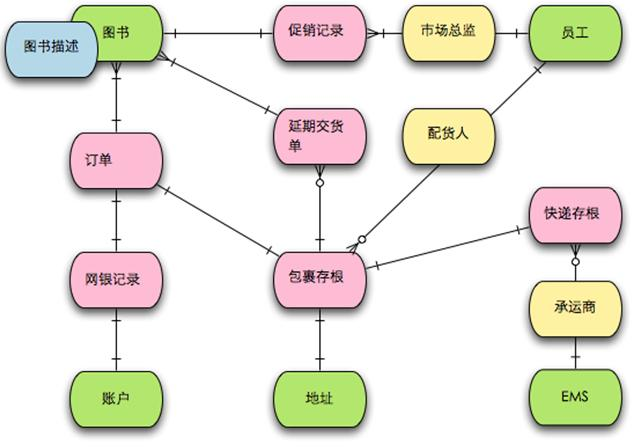

## 价值流建模是什么
价值流建模实际是系统概念建模，包括对象和处理过程。以业务价值流作为切入点，所以叫价值流建模。
对象包括输入输出的价值对象，也包括拥有过程处理能力的功能对象。相互关联关系的对象，可以看成一个大对象。
处理过程也有包含和组合关系。包含指一个处理过程由多个子处理过程组成。组合指几个处理过程串联完成一个功能。

## 价值流建模与流程图的关系
### 业务流程图是什么
### 与流程图的相似点
1. 业务驱动，不关注技术实现
2. 关注业务过程，通过业务过程表述系统行为和功能

### 与流程图的区别
1. 流程图只管业务过程，不关注业务过程节点中的输入输出，也就是不管每个节点的业务增值，只是把事情做了。
2. 流程图只表达过程，不表达结构。而系统是有结构的，比如组合/内聚，所属，继承等结构关系。

## 价值流建模与4色建模的关系
### 4色建模是什么
  

### 与4色建模的相似点
1. 流程
2. 有对象结构
### 与4色建模的区别
 1. 4色建模以表单为核心模型，价值流建模关注价值不限制价值表现形式
 2. 4色建模隐藏了过程

## 价值流建模与DDD事件风暴的关系
### DDD事件风暴是什么
  

### 与DDD事件风暴的相似点
### 与DDD事件风暴的区别
 

### 对应的工具平台设想
#### OPM画图和展示工具与平台
现在可以用vs code + drawio替代
#### 系统概念模型与代码的关系
现在可以做代码架构可视化分析，但没有和概念模型做对应
**问题：**
概念模型和代码不是直接的一一对应关系，怎么做柔性对应？
如何检测概念模型和代码之间的不一致性
#### 系统概念模型与需求场景、系统设计、开发过度讨论关系
概念模型的目的是为了统一语言和促进交流，我们需要把开发环境中的各个交流过程记录下来，
以便分析概念模型是否已经显性化的表示出了重要的东西，是否有不一致的地方。

### 还没答案的问题
价值流建模与非功能性需求之间的关系
#### 可以有关系的非功能性需求
可扩展性，可测试性，可维护性，简单性、可行性
### 现在还不知道怎么产生关系的非功能性需求
安全性、性能、可用性、容错性
