## "产教研"一体化

 

### 关键点:
- “产教研”是同一个人，而不是分别个人或部门
- 角色根据不同专业进行定义，而人是“通才”全方面发展
- 根据个人的能力和岗位不同，承担各个角色的侧重点和比例不同
- “产教研”的聚焦点是知识内容的生产和传播

## 能力大纲-工作任务-培训辅导-认证答辩 人才培养认证体系

 

### 关键点:
- 这是个人能力的发展体系，顺应工作需要完成任务是手段，不是目的。目的是能力得到锻炼和提高
- 能力大纲的目的是为了更好的完成工作任务
- 培训辅导的目的是为了更好的完成工作任务
- 认证答辩的目的是为了认可和发展个人