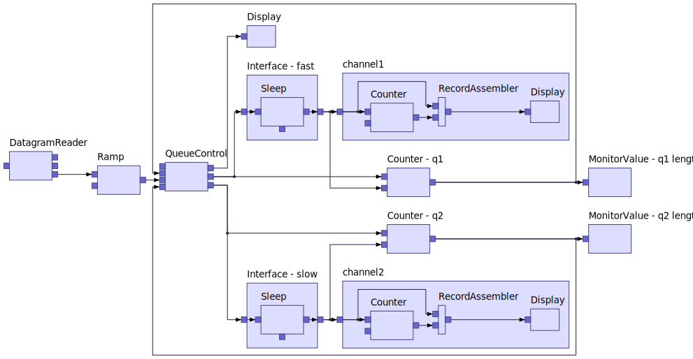
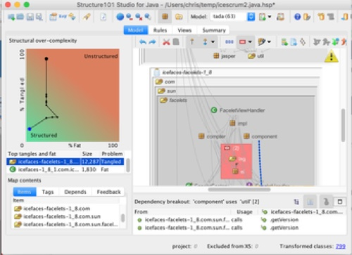
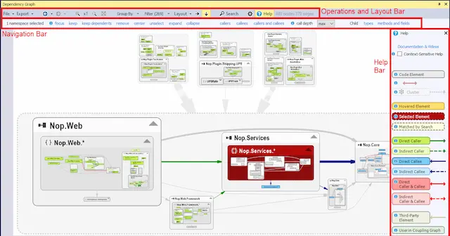
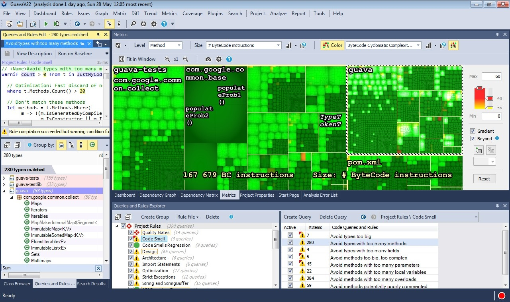

### 架构可视化
设计理念: **任何可视化要素背后是人的认知和活动**
#### 目的
- 让开发更好的理解系统
- 让架构师更好的观察到系统的架构变化，及时做出调整，防止架构腐化
- 让质量管理更精确

 

ELK可视化布局实例

#### 可视化要素和功能
- [x] 代码
    - [x] 模块: 模块间关系，用以界定模块边界和通讯协议(接口，报文)
    - [x] 命名空间：用以组织管理一类事物，可以可视化看到边界和边界间的交互状况
    - [x] 类依赖关系：可视化类关系，用以更好理解模块结构
    - [x] 方法调用关系：可视化业务处理的过程，可以看到目标方法对上游和下游的影响。
    - [ ] 代码行：用以衡量系统规模，体现了开发工作量。
    - [ ] 代码圈复杂度(认知复杂度)：用以衡量系统复杂度，映射出对开发人员认知的要求，体现了开发难度。
- [ ] 代码变化日志(git提交日志)：通过分析git日志文件，得到精确的类、方法变更历史记录，还原出背后开发人员的行为，以及代码变更与需求的关系。
- [ ] 测试覆盖: 通过收集每个测试用例对应的代码覆盖，得到精确的测试用例与代码行的关系，并且用以回溯遗漏出去的bug应该在哪个测试环节进行补救。
- [ ] 架构设计，结合架构设计分析当前代码结构与设计的区别，用以指导架构演进

#### 度量
- [x] 耦合度：高内聚松耦合。 只完成模块间耦合度计算，没有再精确区分出耦合度类型和解耦模式
- [x] 稳定性：多变的依赖少变的

#### 竞品分析
##### [Structure101](https://structure101.com/)
 
##### [Ndepend](https://www.ndepend.com/)
 
##### [JArchitect](https://www.jarchitect.com/)
 
#### 竞争差异
- 针对团队，而不是个人
- 跨项目和编程语言，支持微服务架构分析
- 融入git记录、测试覆盖率等非代码要素，有更多的分析维度